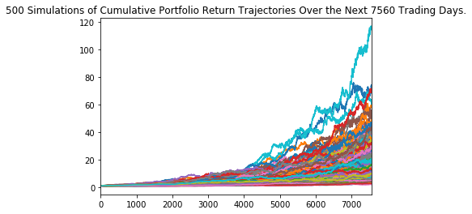
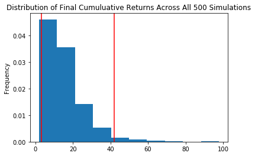
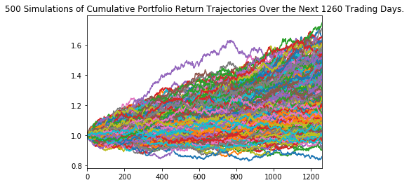
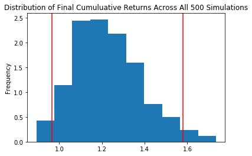
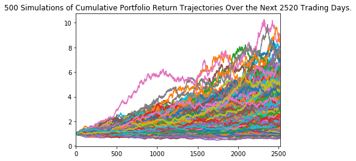
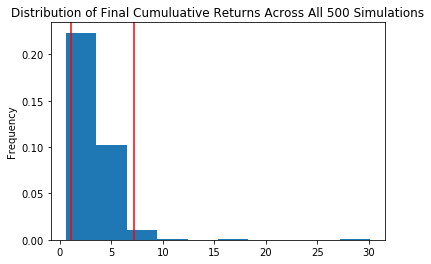

# Homework 5: Financial Planning

[Analysis Notebook](financial-planner.ipynb)

### Simulation and distribution plots

**30 year forecast**

---

**5 year forecast**

---

**10 year forecast**

